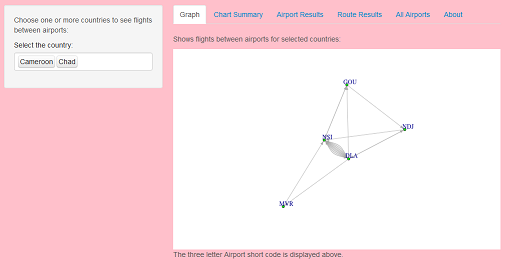

## Overview

The demonstrator shows flights between airports for the countries that the user selects.  

This allows the user to choose to see national and international flights shown on a force directed graph
 (a graph showing directions).
 
The inspiration for the demo comes from wanting to use a slightly different data-set to the normal ones 
and experimenting with the *'igraph'* module.



--- .class #id 

## Instructions for use

The following instructions guide a user around the [demonstrator](https://scarrk.shinyapps.io/PeerAssignmentAirport/):-

1. Select a country (or countries) from multi-selector on the left hand side panel
2. The 'Graph' tab illustrates a visual representation of flights between the airports that exist in
 the selected countries (the airport short code is shown)
3. The 'chart summary' shows the popular airports measured by outbound flights in a bar chart

The remaining tabs provide filtered tabular views on the data with 'All Airports' allowing a user
to search through the master list of airports in the dataset.

By removing (select the country and tap the delete key) and adding countries (click on the item in the list) on the left side panel you can see which countries have international flights between them, otherwise with a single country selected you will see national only flights.

Countries with large numbers of airports and flights may take time to render in the graph view.

--- .class #id 

## Data Set

The demonstrator uses an open source dataset available from [OpenFlights.org](http://openflights.org/data.html#airport) which holds a set of airports and flights (or routes) between them and has a enough records 
to support the demo.

```{r dataload,echo=FALSE,results=FALSE}
airports <- read.csv('airports.dat',header=FALSE,colClasses=rep('character',11) )
routes <- read.csv('routes.dat',header=FALSE,stringsAsFactors=FALSE)
colnames(airports) <- c('Airport ID','Name','City','Country','IATAFAA','ICAO','Latitude','Longitude', 'Altitude','Timezone','DST')
colnames(routes) <- c('Airline','AirlineID','SourceAirport','SourceAirportID','DestinationAirport','DestinationAirportID','Codeshare','Stops','Equipment')
# Filter to Airports that we can routes for
airports <- airports[airports$IATAFAA %in% routes$SourceAirport,]
```

The airports data-set was filtered to only include those that had one or more flights available.  There are `r nrow(airports)` airports and `r nrow(routes)` flights recorded in the data-set.

```{r heatmap,echo=TRUE,results=TRUE,fig.height=3, fig.width=6}
smoothScatter(airports[,c('Latitude','Longitude')])
```
Plot shows a heatmap of airports using Latitude and Longitude.

--- .class #id 

## Summary

### Libraries
* Shiny
* igraph
* plyr
* ggplot2

### Acknowledgements

* http://openflights.org

### Testing
 
* R version 3.1.0 / Windows 7 64bit
